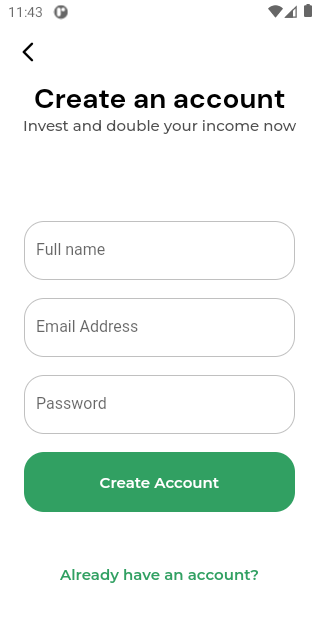
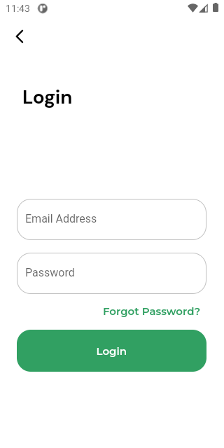
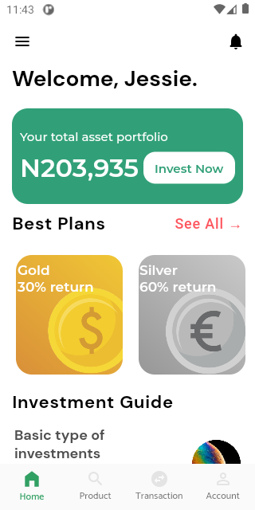
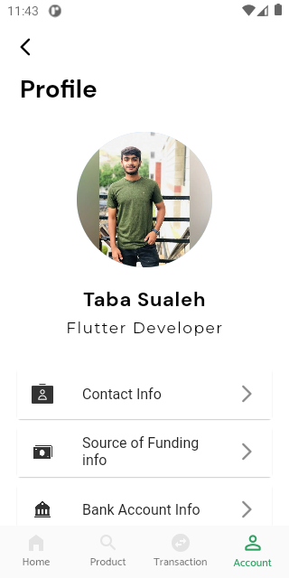
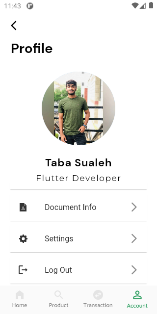
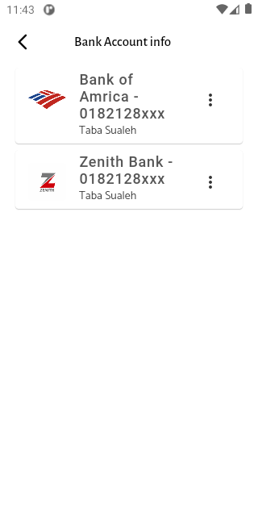

# E-Wallet App

A flutter project of E-Wallet App (Invest App), assignment given by Sir Salman (Instructor Bano Qabil).
Figma Design Link :[ Invest app](https://www.figma.com/file/yPdfYEvJFoiEtbe92RjAQZ/Invest-App-App-design?type=design&node-id=0%3A1&mode=design&t=wJqdyaIIguvwlNUN-1) 
    

## Screen Shot

